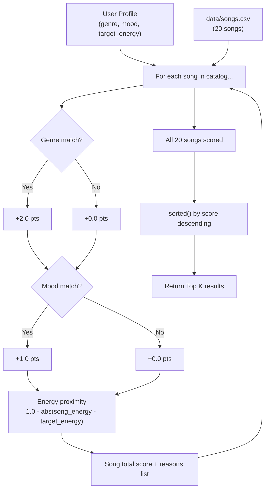

# 🎵 Music Recommender Simulation

## Project Summary

In this project you will build and explain a small music recommender system.

Your goal is to:

- Represent songs and a user "taste profile" as data
- Design a scoring rule that turns that data into recommendations
- Evaluate what your system gets right and wrong
- Reflect on how this mirrors real world AI recommenders

VibeFinder 1.0 is a content-based music recommender that scores every song in a 20-song catalog against a user's stated preferences (genre, mood, and target energy level) and returns a ranked list of the top 5 matches with plain-language explanations. It demonstrates how streaming platforms translate taste data into suggestions, and where simple scoring systems can create biases or filter bubbles.

---

## How The System Works

Real-world recommenders like Spotify and TikTok use a mix of two main approaches. **Collaborative filtering** finds users with similar listening histories and assumes you'll like what they liked — it requires a large crowd of users to work well. **Content-based filtering** looks only at the attributes of the songs themselves (genre, mood, energy) and matches them to a user's stated taste profile — it works with a single user and no history. This simulation uses content-based filtering because it is transparent, explainable, and well-suited to a small catalog.

### Song Features

Each `Song` object uses these attributes from `data/songs.csv`:

| Feature | Type | Used in scoring | Description |
|---|---|---|---|
| `genre` | string | yes | Categorical label (e.g., pop, lofi, rock, jazz) |
| `mood` | string | yes | Categorical label (e.g., happy, chill, intense, moody) |
| `energy` | float 0.0–1.0 | yes | How energetic/loud the track feels |
| `popularity` | int 0–100 | yes (optional) | Relative chart/stream popularity |
| `release_decade` | int | yes (optional) | Decade released: 2000, 2010, or 2020 |
| `tempo_bpm` | float | stored only | Beats per minute |
| `valence` | float 0.0–1.0 | stored only | Musical positivity |
| `danceability` | float 0.0–1.0 | stored only | How suited to dancing |
| `acousticness` | float 0.0–1.0 | stored only | How acoustic (vs. produced) it sounds |

### User Profile

A `UserProfile` stores:
- `favorite_genre` — the genre the user wants to match
- `favorite_mood` — the mood the user wants to match
- `target_energy` — a float 0.0–1.0 representing how intense they want the music
- `target_popularity` *(optional)* — preferred popularity range 0–100
- `target_decade` *(optional)* — preferred release decade (2000, 2010, or 2020)

### Algorithm Recipe (Scoring Rule)

Weights for the three primary signals are controlled by the **scoring mode**:

| Mode | Genre weight | Mood weight | Energy weight | Max base score |
|---|---|---|---|---|
| `balanced` | 2.0 | 1.0 | ×1.0 | 4.0 |
| `genre-first` | 4.0 | 0.5 | ×0.5 | 5.0 |
| `mood-first` | 0.5 | 4.0 | ×0.5 | 5.0 |
| `energy-focused` | 1.0 | 1.0 | ×2.0 | 4.0 |

Optional bonus signals (added on top of any mode, up to +1.0 total):

```
score = 0.0

if song.genre == user.genre         →  + genre_weight  (mode-controlled)
if song.mood  == user.mood          →  + mood_weight   (mode-controlled)
energy_score  = (1.0 - |song.energy - user.energy|) × energy_weight  →  +0.0 to +energy_weight

# optional — only scored when user provides these preferences:
popularity_score = (1.0 - |song.popularity - user.target_popularity| / 100) × 0.5  →  up to +0.5
if song.release_decade == user.target_decade  →  +0.5
```

Energy uses a proximity formula so songs *close* to the target energy earn partial credit regardless of whether they are high or low energy.

### Ranking Rule

After scoring every song, the system sorts all results from highest to lowest score and returns the top K results. This two-step process (score first, rank second) is necessary because a score for one song means nothing without comparing it to all other scores.

### Data Flow Diagram



### Potential Bias

In the default `balanced` mode, the genre weight (+2.0) is double the mood weight (+1.0), so genre alignment dominates. Switching to `mood-first` mode reverses this — a happy song from the wrong genre can outrank an intense song from the right genre. The scoring mode lets you control which signal matters most, but no mode eliminates the underlying problem: with only 1–2 songs per genre in the catalog, a genre match almost guarantees a top-3 finish regardless of how well the song fits the mood or energy.

---

## Getting Started

### Setup

1. Create a virtual environment (optional but recommended):

   ```bash
   python -m venv .venv
   source .venv/bin/activate      # Mac or Linux
   .venv\Scripts\activate         # Windows

2. Install dependencies

```bash
pip install -r requirements.txt
```

3. Run the app:

```bash
python -m src.main
```

### Running Tests

Run the starter tests with:

```bash
pytest
```

You can add more tests in `tests/test_recommender.py`.

---

## Experiments You Tried

### Profile Tests

Four profiles were tested against the 20-song catalog. Terminal output for each is below.

**Happy Pop** `genre=pop | mood=happy | energy=0.8`
- #1 Sunrise City (3.98/4.00) — near-perfect: pop, happy, energy 0.82. Almost the maximum possible score.
- #2 Gym Hero (2.87) — same genre, wrong mood (intense), energy close. Genre alone accounts for most of the score.
- Takeaway: works intuitively. A song has to match all three signals to dominate.

**Chill Lofi** `genre=lofi | mood=chill | energy=0.35`
- #1 Library Rain (4.00/4.00) — perfect score. Every signal aligned.
- Top 3 are all lofi. The catalog has 3 lofi songs so they sweep the top results.
- Takeaway: when multiple songs share the same genre, the catalog depth within that genre drives variety.

**Deep Rock** `genre=rock | mood=intense | energy=0.9`
- #1 Storm Runner (3.99/4.00) — near-perfect. But there is only one rock song in the catalog.
- #2–5 are all from unrelated genres. Gym Hero (#2) scored because of mood match (intense) + energy, not genre.
- Takeaway: **sparse genres are a major limitation**. One rock song means the recommender can't provide meaningful rock variety.

**Adversarial EDM** `genre=edm | mood=peaceful | energy=0.95` *(conflicting signals)*
- #1 Overdrive (edm/energetic, 2.99) — genre match wins even though mood is completely wrong.
- #2 Campfire Lullaby (folk/peaceful, 1.34) — only song with a peaceful mood, but it scores low because its energy (0.29) is far from the target 0.95.
- Takeaway: the system cannot satisfy conflicting preferences. High energy AND peaceful is not representable in the current scoring model.

---

### Experiment: Swapping Genre and Mood Weights

**Default:** genre +2.0, mood +1.0  
**Modified:** genre +1.0, mood +2.0  

Profile tested: `Happy Pop` (genre=pop, mood=happy, energy=0.8)

| Rank | Default weights | Mood-first weights |
|---|---|---|
| #1 | Sunrise City (3.98) | Sunrise City (3.98) — unchanged |
| #2 | Gym Hero (2.87) | **Rooftop Lights (2.96)** |
| #3 | Rooftop Lights (1.96) | **Gym Hero (1.87)** |

Gym Hero (pop/intense) and Rooftop Lights (indie pop/happy) swapped positions. When mood is worth more, "happy" from the wrong genre beats "pop" from the wrong mood. The #1 result didn't change because Sunrise City matches both signals regardless of which weight is higher.

---

## Limitations and Risks

- **Sparse catalog:** Most genres have only 1 song. A rock or metal user gets one good result and four unrelated ones.
- **Genre dominates by default:** The `balanced` mode weights genre at +2.0 vs mood at +1.0. Switching to `mood-first` mode addresses this, but the tradeoff shifts rather than disappears.
- **No memory:** The same profile produces the same results every run — no adaptation, no variety over time.
- **No negative scoring:** Even a completely wrong song earns a small positive energy score, adding noise to every ranking.
- **No language or lyrics:** The system has no understanding of song meaning, only numeric attributes.

See [model_card.md](model_card.md) for a full analysis.

---

## Reflection

[**Model Card**](model_card.md)
[**Prompt Guide Notes**](https://gist.github.com/kyleclai/c4a8aeba98d4bdd12b5d53ae87ad0233)

The most surprising thing about building this was how fast three simple rules started to feel like a real recommendation. Score every song, sort the list, return the top results — that loop alone is enough to produce output that often matches your gut feeling about what you'd want to hear. It made the core idea behind Spotify or YouTube feel much less mysterious. The intelligence isn't in the math; it's in the quality of the features and the size of the catalog.

What changed how I think about real apps is how badly a simple system breaks under contradictory input. When I tested a profile that asked for high energy AND a peaceful mood, the system had no way to satisfy both signals — it just picked a winner (genre) and ignored the conflict. Real platforms face this constantly with users who have genuinely mixed taste, and the difference is that they have thousands of features per song and millions of listeners to learn from. Building a system that fails clearly makes the gap between simple scoring and real personalization feel very concrete.
